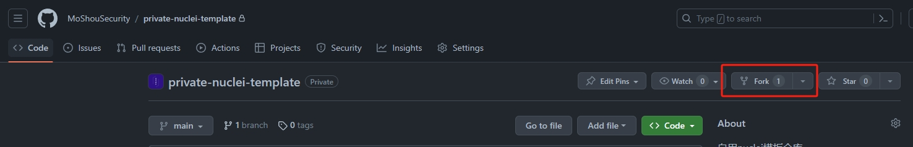
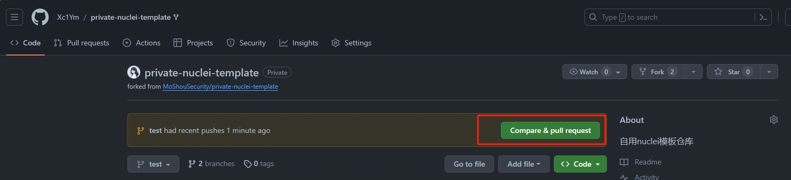
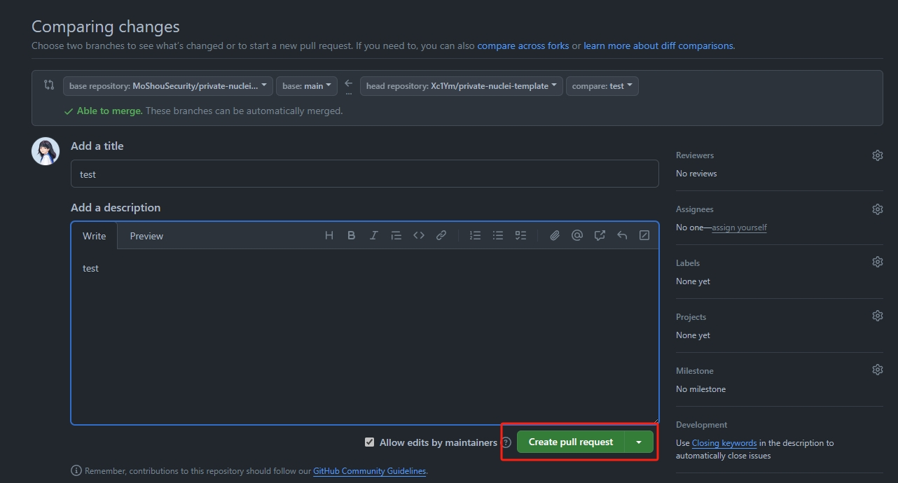

# 如何添加和更新 nuclei 模板

## 1. Fork项目

- 点击右上角的Fork按钮，将项目fork到自己的仓库中。这将在您的Github账号中创建一个副本，同时还需要您设置上游仓库。


    ```bash
    git clone https://github.com/<your_username>/private-nuclei-template.git
    cd private-nuclei-template
    git remote add upstream https://github.com/MoShouSecurity/private-nuclei-template.git
    ```

- 如果您已经Fork了项目，那么您需要将上游仓库的最新代码拉取到本地，以保持您的仓库与上游仓库同步。

    ```bash
    git remote update
    git checkout main
    git rebase upstream/main
    ```

## 2. 创建新的分支

- 创建一个分支，分支名使用漏洞名命名。

    ```bash
    git checkout -b template_branch_name
    ```

## 3. 添加nuclei模板文件

- 创建您的模板。
- 添加所需要的文件或者文件夹。
- 完成后使用下面的命令将您创建好的模板添加到您新创建的分支中。
  
    ```bash
    git add .
    ```

- 提交时请使用如下的信息来简要描述您的更改。

    ```bash
    git commit -m "Added/Fixed/Updated XXX Template"
    ```

- **注意！**
  
  - 每个commit只允许提交一个模板的更改或添加，以方便管理

- 最后，将您的分支推送到远程仓库。

    ```bash
    git push origin template_branch_name
    ```

## 4. 创建PR

- 打开您的Github，点击如图所示的按钮，向上游仓库提交PR。
- 在PR中填写详细的信息信息，包括模板的名称，描述，作者，以及其他信息。填写完成后，您可以点击如图按钮提交您的PR
- 如果经过审核后，您的模板符合要求，您将看到您的PR被接受，您的模板将被添加到上游仓库中。
